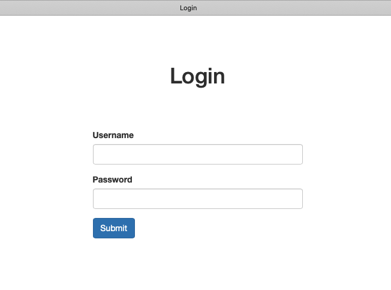

# Background
I had a few ports open to the web at home that connected to a reverse proxy. In terms of security, I had my reverse proxy set up such that if you were scanning subnets and found mine, my proxy forwarded traffic to Google. It got me thinking about how many people were scanning or trying to get into my home network. This application is a simple Flask app that displays a login screen. On load, the App gets the user's IP address, location (url path), and user agent (browser info). When the user pushes a login, Flask captures the above info (minus location) and also username/password. Depeneding on your home network, you could tie in an API such that if an IP address fails 5 times, they are blocked by the firewall. 

# Installation
There are two paths to use this: locally or via Docker. Docker has an issue in that it masquerades IPs coming from the outside. This means that any login attemt will have the Docker IP of your host, which kind of defeats the purpose. That being said, you if you run a reverse proxy in front of the application, you could pass through `x-forwarded-for` (which I do). If this is running open, then the Flask app needs to get `remote_addr` inorder for it to be effective.

## Docker
I am still in the process of getting the SQL DB to load its init file on bring up, so at this point you will still need to manually import the MySQL DB
```bash
cd web-honeypot
docker-compose build --parallel
docker-compose up -d
```

Until I can get Docker to initialize with the SQL file, you will have to run:
```bash
docker exec -i -t database /bin/bash
mysql -uroot -p honeypot < docker-entrypoint-initdb.d/init.sql
mysql -uroot -p mysql < docker-entrypoint-initdb.d/init.sql
```

## Local
Make sure Python3, Pip3 and MySQL are already installed

```bash
pip3 install -r app/requirements.txt
mysql -u < mysql/db.sql
python3 app/app.py
```

# Screenshots

Default index

After a user pushes a login, it displays `Incorrect Credentials`

Entries in the database, I've censored my IP address.

# Future Enhancements
I am planning on adding Grafana to visualize the data
